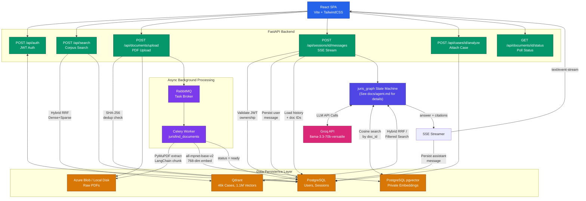

# JurisFind

AI-powered legal research and conversational analysis platform. Search across 46,000+ indexed Indian Supreme Court judgments using semantic similarity, chat with specific cases or your own uploaded PDFs, and ask general legal questions — all from a single persistent workspace backed by a LangGraph agent orchestrator.

## Table of Contents

- [Features](#features)
- [Architecture](#architecture)
- [Tech Stack](#tech-stack)
- [Project Structure](#project-structure)
- [Quick Start](#quick-start)
- [Environment Variables](#environment-variables)
- [Documentation](#documentation)

## Features

**Semantic Search**
Natural language search over 46,456 pre-indexed Indian Supreme Court judgments. Queries are embedded using `sentence-transformers/all-mpnet-base-v2` and compared against a Qdrant vector database (1.1M+ vectors). Results are ranked by cosine similarity and include metadata filters for court, year, state, and case type.

**Agentic RAG Chat**
Every chat request flows through a LangGraph state machine that classifies intent and routes to one of three execution paths: general legal knowledge, document-specific RAG, or full corpus search. The classifier and the answer node together make exactly two LLM calls per request. Citations are built directly from Qdrant payload metadata — no LLM extraction.

**Document-Specific Chat**
Clicking Analyze on a corpus search result or uploading a private PDF attaches it to a chat session. The agent automatically searches the correct vector store: Qdrant (filtered by document ID) for corpus cases, pgvector for private uploads. Both paths produce cited, grounded answers.

**Private PDF Upload**
Users can upload their own confidential PDFs. A Celery worker asynchronously extracts text via PyMuPDF, chunks it with LangChain, generates 768-dim embeddings, and stores them in the private pgvector store isolated by `owner_id`. Private documents never interact with the shared Qdrant corpus.

**Session Management**
Conversations are persistent and multi-document. Each session stores ordered messages, attached documents, and citations in PostgreSQL. Sessions are strictly isolated by `user_id` and `session_id` — every API request re-validates JWT ownership before any data is read or written.

## Architecture



Infrastructure layers:

- **FastAPI** handles HTTP, JWT auth, session ownership, and SSE streaming.
- **LangGraph** orchestrates intent classification and retrieval routing.
- **Celery + RabbitMQ** processes document uploads asynchronously.
- **PostgreSQL + pgvector** stores relational data and private document vectors.
- **Qdrant** stores the 46k-case shared corpus (1.1M vectors, metadata indexed).
- **Groq** runs `llama-3.3-70b-versatile` for LLM inference.

## Tech Stack

| Component | Technology |
|---|---|
| Frontend | React 18, Vite, TailwindCSS |
| Backend | FastAPI, Python 3.9+, SQLAlchemy, Alembic |
| Agent Orchestration | LangGraph, LangChain |
| Task Queue | Celery, RabbitMQ |
| Database | PostgreSQL 17, pgvector |
| Vector Store (Corpus) | Qdrant |
| LLM | Groq llama-3.3-70b-versatile |
| Embeddings | sentence-transformers/all-mpnet-base-v2 (768-dim) |
| PDF Processing | PyMuPDF, LangChain RecursiveCharacterTextSplitter |
| File Storage | Azure Blob Storage (or local fallback) |
| Deployment | Docker Compose, Azure VM, Azure Static Web Apps |

## Project Structure

```
JurisFind/
├── backend/
│   ├── alembic/                  # Database migrations
│   ├── app/
│   │   ├── agents/               # LangGraph agent orchestrator
│   │   │   ├── graph.py          # Compiled StateGraph singleton
│   │   │   ├── state.py          # JurisFindState TypedDict
│   │   │   └── nodes/
│   │   │       ├── classifier.py     # Node 1: intent + guardrail
│   │   │       ├── general_chat.py   # Node 2A: general legal Q&A
│   │   │       ├── document_chat.py  # Node 2B: document RAG
│   │   │       ├── corpus_search.py  # Node 2C: full corpus search
│   │   │       ├── _embedder.py      # Shared embedding helper
│   │   │       └── _qdrant.py        # Shared Qdrant client
│   │   ├── api/                  # FastAPI routers
│   │   │   ├── auth.py           # Register, login, profile
│   │   │   ├── sessions.py       # Chat sessions + SSE streaming
│   │   │   ├── documents.py      # PDF upload and status
│   │   │   ├── cases.py          # Corpus case management
│   │   │   ├── search.py         # Semantic search endpoints
│   │   │   └── dependencies/     # JWT validation
│   │   ├── db/
│   │   │   ├── models.py         # SQLAlchemy models
│   │   │   ├── crud/             # Repository functions
│   │   │   └── session.py        # DB session management
│   │   ├── schemas/              # Pydantic request/response models
│   │   ├── services/             # Embedding, retrieval, blob storage
│   │   ├── workers/              # Celery document processing task
│   │   └── main.py               # App factory
│   └── requirements.txt
├── frontend/
│   └── src/
│       ├── components/           # Reusable UI components
│       ├── context/              # React Auth Context
│       └── pages/                # Search, Assistant, Login pages
├── docs/                         # Technical documentation
└── docker-compose.yml
```

## Quick Start

### Prerequisites

- Python 3.9+
- Node.js 18+
- Docker and Docker Compose
- Groq API key from console.groq.com
- Qdrant running locally on port 6333

### Backend

```bash
# 1. Start infrastructure
docker compose up db rabbitmq -d

# 2. Set up Python environment
cd backend
python -m venv venv
# Windows: .\venv\Scripts\activate
# Linux/Mac: source venv/bin/activate
pip install -r requirements.txt

# 3. Configure environment
cp .env.example .env
# Edit .env — set GROQ_API_KEY, DATABASE_URL, RABBITMQ_URL

# 4. Run database migrations
alembic upgrade head

# 5. Start API server
uvicorn app.main:create_app --factory --host 0.0.0.0 --port 8000 --reload

# 6. Start Celery worker (separate terminal)
celery -A app.workers.celery_app worker --loglevel=info -Q jurisfind_documents
```

### Frontend

```bash
cd frontend
npm install
npm run dev
```

Open `http://localhost:5173`.

## Environment Variables

### Backend (`backend/.env`)

| Variable | Description |
|---|---|
| `DATABASE_URL` | PostgreSQL connection string |
| `RABBITMQ_URL` | RabbitMQ connection string |
| `GROQ_API_KEY` | Required for LLM inference |
| `SECRET_KEY` | JWT signing key |
| `QDRANT_HOST` | Qdrant host (default: localhost) |
| `QDRANT_PORT` | Qdrant port (default: 6333) |
| `AZURE_STORAGE_CONNECTION_STRING` | Optional, enables Azure Blob Storage |
| `GROQ_MODEL` | LLM model name (default: llama-3.3-70b-versatile) |

### Frontend (`frontend/.env`)

| Variable | Description |
|---|---|
| `VITE_API_BASE_URL` | Backend URL (default: http://localhost:8000) |

## Documentation

Detailed technical documentation is in the `docs/` directory:

- `docs/01_overview.md` — System overview and architecture diagram
- `docs/02_data_flows.md` — End-to-end data flow for every user action
- `docs/03_agent.md` — LangGraph agent design, nodes, and routing logic
- `docs/04_api_reference.md` — All API endpoints with request/response details
- `docs/05_setup_and_installation.md` — Local setup and deployment guide
