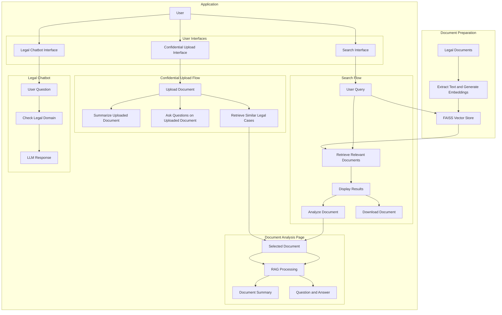

# JurisFind

     

AI-powered legal document search and analysis platform. Search across 46,456+ legal cases using semantic similarity, read AI-generated summaries, ask follow-up questions, upload confidential documents for isolated analysis, and consult a legal domain chatbot — all backed by a FastAPI backend deployed on Azure.

---

## Table of Contents

- [Features](#features)
- [Architecture](#architecture)
- [Tech Stack](#tech-stack)
- [Quick Start](#quick-start)
- [Project Structure](#project-structure)
- [Environment Variables](#environment-variables)
- [API Reference](#api-reference)
- [Documentation](#documentation)
- [Deployment](#deployment)
- [UI Design History](#ui-design-history)
- [Contributing](#contributing)
- [License](#license)

---

## Features

### Semantic Search
Natural language search over 46,456 indexed legal cases. Queries are embedded using `sentence-transformers/all-mpnet-base-v2`, compared against a pre-built FAISS index using cosine similarity, and results are returned ranked by relevance score. See [docs/query_pipeline.md](docs/query_pipeline.md) for the full search flow.

### PDF Analysis and Contextual Q&A
Clicking any search result opens a document analysis view. The API downloads the PDF from Azure Blob Storage (or local fallback), extracts text with PyMuPDF, chunks it, builds a temporary per-session FAISS vector store, and passes it to a Groq LLM for summarization. Users can then ask follow-up questions against the same temporary store without re-processing the document. The temporary embeddings are cleaned up at the end of the session.

### Confidential Document Analysis
Users can upload their own PDF directly from the browser. The file is saved to an ephemeral Docker volume (`confidential_tmp`), processed identically to the PDF analysis flow, and the session is cleared the moment the user uploads a new file or requests deletion. The document never reaches Azure Blob Storage — it stays on the VM in the ephemeral volume.

### Legal Chatbot
A general-purpose AI assistant pre-prompted for legal domain queries. Accepts a message and conversation history, passes them through a LangChain agent backed by Groq, and returns a streamed response.

---

## Architecture

For a deeper breakdown of individual components, see [docs/architecture.md](docs/architecture.md) and [docs/technical_documentation.md](docs/technical_documentation.md).



---

## Tech Stack

| Layer | Technology | Notes |
|---|---|---|
| Frontend | React 18, Vite, TailwindCSS, react-markdown, lucide-react | Deployed on Azure Static Web Apps |
| Backend | FastAPI, uvicorn (factory mode), Python 3.11 | Dockerized, running on Azure VM |
| LLM | Groq `llama-3.3-70b-versatile` via LangChain | Used for summarization, Q&A, chatbot |
| Embeddings | `sentence-transformers/all-mpnet-base-v2` | HuggingFace, runs inside the container |
| Search | FAISS (cosine similarity) | 46,456 cases indexed, loaded from Blob on startup |
| PDF Processing | PyMuPDF, LangChain RecursiveCharacterTextSplitter | Chunk size 1000, overlap 200 |
| Storage | Azure Blob Storage (`jurisfindstore`, container `data`) | Holds PDFs (5.3 GB) and FAISS index (136 MB) |
| Reverse Proxy | Nginx | Proxies port 80 to FastAPI port 8000, 20 MB upload limit |
| Hosting — Backend | Azure VM, Standard D2alds v7, Ubuntu 24.04, East US 2 | `20.186.113.106` |
| Hosting — Frontend | Azure Static Web Apps (free tier) | `https://blue-cliff-0dfeb910f.2.azurestaticapps.net` |
| CI/CD | GitHub Actions | Frontend auto-deploys on push to main |

---

## Quick Start

### Prerequisites

- Python 3.9+
- Node.js 18+
- A Groq API key from [console.groq.com](https://console.groq.com/keys)
- The FAISS index files (see [Generating the Index](#generating-the-index) below)

### Backend

```bash
cd api
python -m venv venv
source venv/bin/activate        # Windows: venv\Scripts\activate
pip install -r requirements.txt
cp .env.example .env
# Open .env and set GROQ_API_KEY
uvicorn main:create_app --factory --host 0.0.0.0 --port 8000 --reload
```

Verify: `curl http://localhost:8000/api/health`

### Frontend

```bash
cd frontend
npm install
npm run dev
```

Open `http://localhost:5173`

### Generating the Index

If you have PDFs in `api/data/pdfs/`, generate the FAISS index locally:

```bash
cd api
python helpers/generate_embeddings.py
```

This produces `api/data/faiss_store/legal_cases.index` and `api/data/faiss_store/id2name.json`. See [docs/ingestion_pipeline.md](docs/ingestion_pipeline.md) for details on the chunking and embedding strategy.

For Azure Blob Storage setup (production), see [docs/azure_integration.md](docs/azure_integration.md).

---

## Project Structure

```
JurisFind/
├── api/
│   ├── main.py                      # FastAPI app factory, CORS, router registration
│   ├── Dockerfile                   # Python 3.11-slim, uvicorn factory mode
│   ├── requirements.txt
│   ├── .env.example                 # Template — copy to .env
│   ├── agents/
│   │   ├── legal_agent.py           # LangChain agent: PDF summarization + Q&A
│   │   └── legal_chatbot.py         # LangChain agent: general legal chatbot
│   ├── confidential/
│   │   └── confidential_pdf.py      # Confidential PDF processing
│   ├── helpers/
│   │   ├── azure_blob_helper.py     # Blob upload, download, FAISS sync
│   │   ├── azure_data_manager.py    # CLI tool for blob management
│   │   └── generate_embeddings.py   # One-time FAISS index builder
│   ├── routes/
│   │   └── routes.py                # All API endpoints
│   ├── services/
│   │   └── search_service.py        # FAISS search logic, downloads from Blob on startup
│   ├── upload_to_blob.py            # One-time script: upload FAISS files to Blob
│   └── data/
│       ├── faiss_store/             # legal_cases.index + id2name.json (gitignored)
│       └── pdfs/                    # 48K legal case PDFs (gitignored)
├── frontend/
│   ├── vite.config.ts
│   ├── tailwind.config.js
│   └── src/
│       ├── App.jsx                  # Routes definition
│       ├── config/api.js            # Base URL from VITE_API_BASE_URL env var
│       ├── components/
│       │   ├── Navigation.jsx
│       │   └── Footer.jsx
│       └── pages/
│           ├── LandingPage.jsx
│           ├── SearchPage.jsx       # Semantic search UI
│           ├── PdfAnalysis.jsx      # Document summary + chat UI
│           ├── LegalChatbot.jsx     # Legal AI chatbot UI
│           └── ConfidentialUpload.jsx  # Private PDF upload + analysis UI
├── nginx.conf                       # VM reverse proxy config
├── docker-compose.yml               # API container + confidential_tmp volume
└── .github/
    └── workflows/
        └── azure-static-web-apps-*.yml  # Auto-generated by Azure portal
```

---

## Environment Variables

Full reference in [api/.env.example](api/.env.example).

| Variable | Required | Description |
|---|---|---|
| `GROQ_API_KEY` | Yes | Groq API key for LLM inference |
| `GROQ_MODEL` | No | Defaults to `llama-3.3-70b-versatile` |
| `AZURE_STORAGE_CONNECTION_STRING` | Production only | Full Azure Blob connection string |
| `AZURE_DATA_CONTAINER` | Production only | Blob container name, defaults to `data` |
| `USE_LOCAL_FILES` | No | `true` = local FAISS files, `false` = download from Blob on startup |
| `API_HOST` | No | Defaults to `0.0.0.0` in Docker, `localhost` locally |
| `API_PORT` | No | Defaults to `8000` |

Frontend (Vite):

| Variable | Description |
|---|---|
| `VITE_API_BASE_URL` | Full base URL of the API, e.g. `http://20.186.113.106`. Defaults to `http://localhost:8000` |

---

## API Reference

| Method | Endpoint | Body / Params | Description |
|---|---|---|---|
| GET | `/api/health` | — | Returns `{status, message, total_cases}` |
| POST | `/api/search` | `{query, top_k}` | Semantic search — returns ranked `{filename, score, similarity_percentage}` list |
| POST | `/api/unified/analyze` | `{filename, source}` | Analyze a PDF (`source`: `"database"` or `"uploaded"`) — returns AI summary |
| POST | `/api/unified/ask` | `{filename, question, source}` | Q&A against an analyzed document's embeddings |
| GET | `/api/pdf/{filename}` | — | Streams PDF binary from Blob Storage or local fallback |
| GET | `/api/document-stats/{filename}` | — | Returns embedding and document statistics |
| POST | `/api/upload-confidential-pdf` | `multipart/form-data` (file) | Upload a confidential PDF to ephemeral Docker volume |
| POST | `/api/retrieve-similar-cases` | `?filename=X&top_k=5` | Find similar cases from the main index matching an uploaded PDF |
| DELETE | `/api/cleanup-confidential/{filename}` | — | Delete confidential session and temp files |
| POST | `/api/legal-chat` | `{question}` | General legal AI chatbot (domain-filtered) |

Interactive Swagger UI: `http://20.186.113.106/docs`

Full request/response schemas: [docs/api_reference.md](docs/api_reference.md)

---

## Documentation

| Document | Contents |
|---|---|
| [docs/architecture.md](docs/architecture.md) | Component diagram, layer responsibilities, data flow overview |
| [docs/ingestion_pipeline.md](docs/ingestion_pipeline.md) | PDF text extraction, chunking strategy, FAISS index construction |
| [docs/query_pipeline.md](docs/query_pipeline.md) | Query embedding, FAISS search, LangChain agent flow, prompt templates |
| [docs/api_reference.md](docs/api_reference.md) | Full endpoint reference with request/response schemas |
| [docs/azure_integration.md](docs/azure_integration.md) | Azure Blob Storage setup, container structure, ingestion to Blob, env config |
| [docs/deployment.md](docs/deployment.md) | VM setup, Docker, Nginx, Azure Static Web Apps, CI/CD, update workflow |
| [docs/TECHNICAL_DOCUMENTATION.md](docs/TECHNICAL_DOCUMENTATION.md) | Comprehensive internal reference covering all subsystems |

---

## Deployment

See [docs/deployment.md](docs/deployment.md) for the complete guide covering:

- Azure VM provisioning and Docker setup
- Nginx reverse proxy configuration
- Azure Static Web Apps setup and GitHub Actions workflow
- Updating the backend after a code change
- Environment variable management on the VM

---

## UI Design History

The table below tracks every significant change to the JurisFind frontend UI, including the date it was introduced, the component(s) affected, and a brief description of the change.

| Date | Version | Component(s) | Description |
|------|---------|--------------|-------------|
| 2026-03-04 | v1.0 | All pages | **Initial UI design.** Introduced the full frontend built with React 18 and Tailwind CSS. Key design decisions: warm off-white background (`#EAEAE4`), sticky frosted-glass navigation bar, serif display headings with tight letter-spacing, amber/orange accent palette, rounded-full buttons, and card-based layout throughout. Pages shipped: Landing, Case Search, PDF Analysis, Legal Chatbot, Confidential Upload. |

### Design System (v1.0)

| Token | Value | Usage |
|-------|-------|-------|
| Background | `#EAEAE4` | Page background |
| Surface | `#FFFFFF` | Cards, navbar |
| CTA surface | `#E0E0DA` | Bottom CTA section |
| Primary text | `gray-900` | Headings, labels |
| Muted text | `gray-500` / `gray-400` | Subtitles, placeholders |
| Accent | `amber-400` → `orange-500` | Avatar gradient, document icons |
| Primary action | `bg-gray-900 text-white rounded-full` | Buttons |
| Border radius | `rounded-2xl` (cards), `rounded-full` (pills) | Containers and buttons |
| Font — display | `font-serif-display` | Hero and section headings |
| Font — body | System sans-serif (Tailwind default) | Body text |
| Shadow | `shadow-2xl` (product mockup), `shadow-md` (hover cards) | Depth |

---

## Contributing

1. Fork the repository
2. Create a feature branch off `main`
3. Follow PEP 8 for Python and ESLint config for JavaScript
4. Add or update tests in `api/tests/` for backend changes
5. Open a pull request with a clear description of the change

Backend tests:
```bash
cd api && python -m pytest tests/
```

---

## License

MIT
