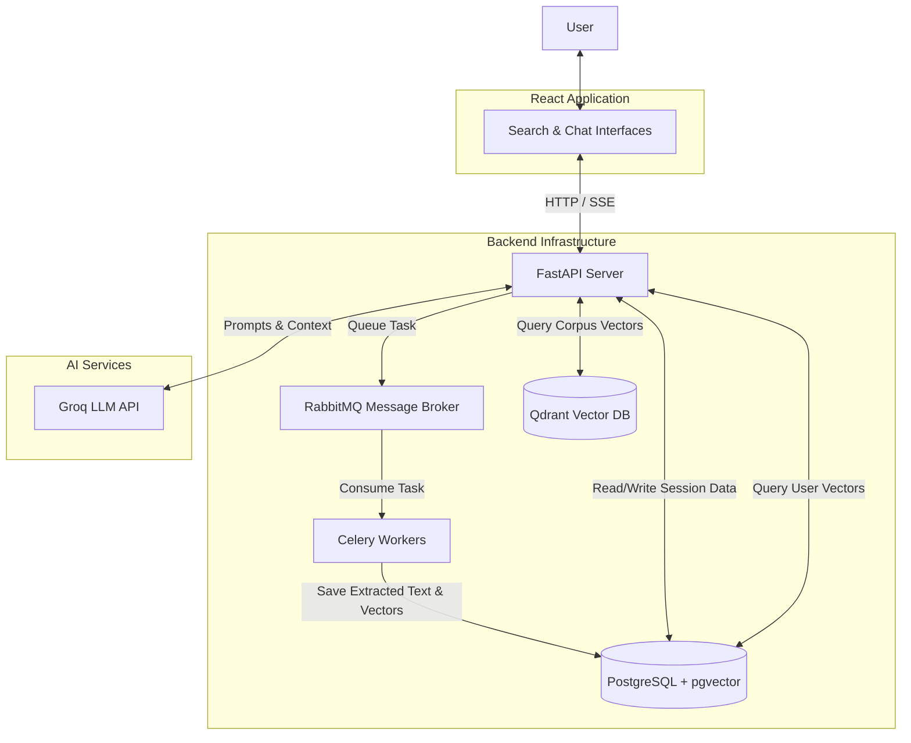

# JurisFind: System Overview

JurisFind is a modern, decoupled web application that provides a sophisticated legal research and conversational AI experience. It uses an event-driven architecture designed for scalability and responsiveness.

## High-Level Architecture

The system is composed of several specialized layers:

1. **Frontend (React / Vite):** Single Page Application (SPA) styled with TailwindCSS. It manages UI state, user authentication, and streams AI responses in real-time via Server-Sent Events (SSE).
2. **Backend (Python FastAPI):** The main entry point. It handles HTTP requests, authenticates users, manages database interactions, and delegates heavy processing to background workers.
3. **Background Processing (Celery & RabbitMQ):** Asynchronous workers backed by an AMQP broker (RabbitMQ) handle document processing (PDF parsing, chunking, and embedding generation) without blocking the API.
4. **Databases:**
    *   **PostgreSQL (`pgvector`):** Stores relational data (users, sessions, messages, documents) and vector embeddings for private, user-uploaded documents.
    *   **Qdrant:** A high-performance vector database hosting the pre-processed 46k global legal case corpus, supporting metadata filtering and fast semantic search.
5. **AI Services:**
    *   **Sentence Transformers:** Local CPU embedding generation (`all-mpnet-base-v2`).
    *   **Groq API:** Fast LLM inference (`llama-3.3-70b-versatile`) for RAG and chat.

## Core Features

### 1. Dual-Vector-Store Architecture
JurisFind employs a sophisticated dual-vector approach to balance privacy and scale:
*   **Private User Documents (`pgvector` in PostgreSQL):** Strictly used for User Uploads and Session RAG. Tying vectors directly to the relational database makes access control (user ownership, session attachment) trivial and guarantees that private data never leaks into the global corpus.
*   **Global Legal Corpus (`Qdrant`):** Used for searching the 46k pre-processed legal cases. It provides high-speed semantic search, complex metadata filtering (Court, Year, Case Type) directly during the vector search phase, and centroid aggregation. 

### 2. Intelligent Chat & Session Management
*   **Unified Workspace:** The Assistant Page (`/chat/:sessionId`) handles real-time SSE streaming for chat responses, staging uploaded PDFs, and displaying retrieved citations natively with an inline PDF Viewer Modal.
*   **Dynamic RAG Routing:** When a user chats in a session, the API checks for attached documents.
    *   **If docs are attached:** It runs **Private RAG** (searches only the user's private `pgvector` database chunks).
    *   **If no docs are attached:** It runs the **General Legal Chatbot** (no context retrieval).

### 3. Asynchronous Document Pipeline
User uploads are handled entirely asynchronously to prevent blocking the web API:
1.  **Upload:** User uploads a PDF. File saved locally (or Blob Storage). Database record created with status `uploaded`.
2.  **Worker:** Celery task `process_document_task` picks it up.
3.  **Extraction:** `PyMuPDF` extracts text and page numbers.
4.  **Chunking:** `langchain` splits text into 1000-char chunks.
5.  **Embedding:** `SentenceTransformer` (running in the worker) generates 768-dim vectors.
6.  **Storage:** Chunks and Vectors are written to PostgreSQL (`document_chunks` and `document_embeddings` via `pgvector`).
7.  **Status:** Document marked as `ready` and frontend is notified.
