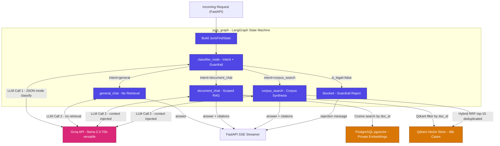

# LangGraph Agent

The LangGraph agent (`juris_graph`) is the intelligence layer of JurisFind. It replaces the original dual-branch if/else logic in `sessions.py` with a compiled state machine that classifies intent and routes every request to the correct retrieval and generation path.

## State

`JurisFindState` is a `TypedDict` defined in `app/agents/state.py`. A fresh instance is created at the start of every chat request and discarded after the SSE stream closes. There is no checkpointing or persistence at the LangGraph layer.

```python
class JurisFindState(TypedDict):
    # Input fields
    session_id:       str
    user_id:          str
    question:         str
    history:          list[dict]    # last 6 messages loaded from DB
    explicit_mode:    Optional[str] # "auto" | "document" | "corpus"
    document_ids:     list[str]     # IDs of documents attached to this session

    # Classifier output
    is_legal:         bool
    intent:           str           # "general" | "document_chat" | "corpus_search"

    # Retrieval output
    retrieved_chunks: list[dict]
    citations:        list[dict]    # built from chunk payload, not LLM output

    # Final output
    answer:           str
    error:            Optional[str]
```

## Graph Topology



Compiled in `app/agents/graph.py` as a module-level singleton `juris_graph = build_graph()`.

## Node 1: classifier

**File:** `app/agents/nodes/classifier.py`

**Purpose:** Does two things in a single LLM call:
1. Determines if the question is in the legal domain (guardrail).
2. Classifies the user's intent.

**Fast-path override:** If `explicit_mode` is "document" or "corpus", the LLM call is skipped entirely and the intent is set directly.

**LLM call:** One Groq call with `response_format={"type": "json_object"}`, `temperature=0.0`, `max_tokens=100`. Returns:
```json
{
  "is_legal": true,
  "intent": "corpus_search",
  "reasoning": "User is asking about multiple cases"
}
```

**Routing function (`route_after_classifier`):**
- `is_legal=false` -> "blocked"
- `intent="general"` -> "general_chat"
- `intent="document_chat"` -> "document_chat"
- `intent="corpus_search"` -> "corpus_search"

**Edge cases handled:**
- If intent is "document_chat" but `document_ids` is empty, falls back to "corpus_search".
- If the Groq call fails, defaults to "general" with error logged.
- Intent values outside the known set are normalized to "general".

**Intent classification rules:**
- `general`: pure legal knowledge question, no document search required. Example: "What is Article 21?"
- `document_chat`: question is specifically about attached documents. Only classified here if `document_ids` is non-empty.
- `corpus_search`: question requires searching across multiple cases. Example: "How has the Supreme Court ruled on right to privacy?"
- Non-legal topics (coding, sports, weather, cooking) classify as `is_legal=false`.

## Node 2A: general_chat

**File:** `app/agents/nodes/general_chat.py`

**Purpose:** Answers pure legal knowledge questions with no retrieval.

**Input used:** `question`, `history`

**LLM call:** One Groq call at `temperature=0.3`, `max_tokens=1024`. System prompt positions the AI as an Indian legal expert. Conversation history is included for follow-up context.

**Output:** `answer` string. `citations` and `retrieved_chunks` are empty lists.

## Node 2B: document_chat

**File:** `app/agents/nodes/document_chat.py`

**Purpose:** Retrieves chunks from attached session documents and generates a grounded answer.

**Retrieval routing per document:**

| `source_type` | Vector Store | Method |
|---|---|---|
| `legal_case` | Qdrant | Filtered search by `document_id` in `legal_corpus` collection, limit 8 |
| `uploaded` | pgvector | Raw SQL cosine search filtered by `document_id`, limit 8 |

The node iterates over all `document_ids` in state, fetches chunks from each, and concatenates them into one context block. This allows multi-document RAG in a single session.

**Citation construction:** Built directly from the chunk payload/row without any LLM call:
- Qdrant chunks: `document_id`, `chunk_id`, `title`, `court`, `year`, `citation`, `score`
- pgvector chunks: `document_id`, `chunk_id`, `title`, `page_number`, `filename`, `score`

**LLM call:** One Groq call at `temperature=0.1`, `max_tokens=1500`. The system prompt instructs the model to answer using only the provided source blocks and to cite inline as `[Case Name, Year]`.

## Node 2C: corpus_search

**File:** `app/agents/nodes/corpus_search.py`

**Purpose:** Searches the full 46k-case Qdrant corpus and synthesises a multi-case answer.

**Retrieval:**
1. Embeds the question using the shared `_embedder.embed()` helper.
2. Queries Qdrant (`legal_corpus`) without any document filter, limit 15.
3. Deduplicates results by `document_id`: keeps the highest-scoring chunk per document.
4. Takes the top 5 unique documents.

**Citation construction:** Same pattern as Node 2B — built from Qdrant payload.

**LLM call:** One Groq call at `temperature=0.2`, `max_tokens=1800`. System prompt positions the model as a senior Indian legal expert synthesising across multiple judgments.

## Node: blocked

**File:** `app/agents/graph.py` (inline function)

**Purpose:** Handles non-legal questions. Sets a fixed rejection message in `state["answer"]` and routes to END. No LLM call.

## Shared Utilities

**`_embedder.py`**
Delegates to the project-wide `app.services.embedding_service.embed_query`. The `SentenceTransformer` model is loaded once per process via the singleton in `embedding_service.py`.

**`_qdrant.py`**
Returns a module-level `QdrantClient` singleton. Connection parameters from `QDRANT_HOST` and `QDRANT_PORT` environment variables (defaults: `localhost:6333`).

## FastAPI Integration

The `send_message` endpoint in `app/api/sessions.py` drives the graph:

```python
    async def generate():
        final_answer    = ""
        final_citations = []

        try:
            final_state     = await juris_graph.ainvoke(initial_state)
            final_answer    = final_state.get("answer", "")
            final_citations = final_state.get("citations", [])

            if final_answer:
                yield f"data: {json.dumps({'content': final_answer})}\n\n"
            else:
                yield f"data: {json.dumps({'content': 'No response was generated. Please try again.'})}\n\n"

        except Exception as exc:
            yield f"data: {json.dumps({'content': '[Server busy. Please try again in a moment.]'})}\n\n"

        yield "data: [DONE]\n\n"

        if final_citations:
            yield f"event: citations\ndata: {json.dumps(final_citations)}\n\n"
```

Because nodes use synchronous raw Groq API calls (`stream=False`), we use `ainvoke()` to run the full graph and return the final state, then emit the complete answer as a single SSE chunk. If true token-by-token streaming is required in the future, the nodes must be rewritten to use `ChatGroq` with LangChain streaming enabled, at which point the API could switch back to `astream_events`.
