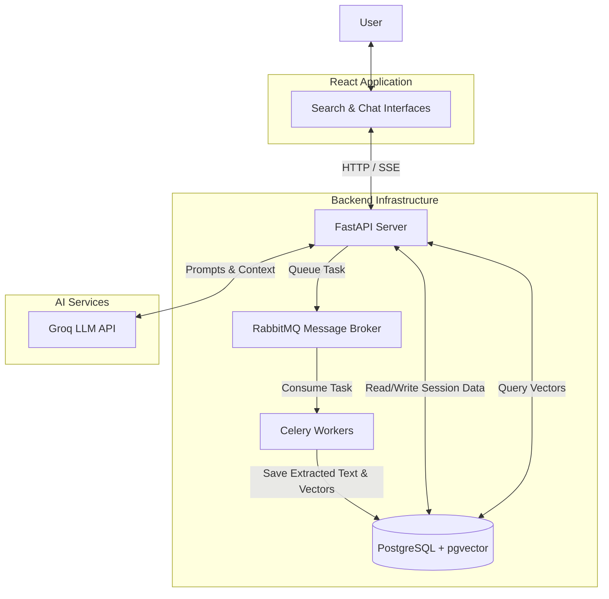

# System Architecture

JurisFind uses a decoupled, event-driven architecture designed for scalability and responsiveness.

## High-Level Flow

1. **Client Layer (React Frontend)**: Manages UI state, handles user authentication, and streams AI responses via Server-Sent Events (SSE).
2. **API Layer (FastAPI)**: Serves as the main entry point. It handles HTTP requests, authenticates users, reads/writes to the database, and delegates heavy processing to background workers.
3. **Message Broker (RabbitMQ)**: Queues background tasks, ensuring the API layer remains non-blocking.
4. **Worker Layer (Celery)**: Consumes tasks from RabbitMQ. Responsible for downloading PDFs, extracting text, generating vector embeddings, and saving them to the database.
5. **Database Layer (PostgreSQL + pgvector)**: Stores relational data (users, sessions, messages, documents) and vector embeddings for semantic search and retrieval.
6. **AI Layer (Groq & LangChain)**: Executes Retrieval-Augmented Generation (RAG) and conversational AI tasks.

## Data Flow: Document Processing

1. User uploads a PDF or selects a case from the corpus.
2. Frontend sends an API request to `POST /api/documents`.
3. FastAPI saves the file locally, creates a database record (status: `uploaded`), and enqueues a Celery task.
4. FastAPI immediately returns a `202 Accepted` response with the document ID.
5. Celery worker picks up the task:
   - Extracts text using PyMuPDF.
   - Splits text into chunks using LangChain.
   - Generates embeddings using `sentence-transformers`.
   - Inserts chunks and vectors into the `document_chunks` table via `pgvector`.
   - Updates document status to `ready`.
6. Frontend polls the document status and updates the UI when `ready`.

## Data Flow: RAG Query

1. User sends a message in a session with attached documents.
2. FastAPI computes the embedding for the user's query.
3. FastAPI queries PostgreSQL using `pgvector` (`<->` cosine distance operator) to find the most relevant chunks specific to the current session's documents.
4. The retrieved chunks are formatted into a context prompt.
5. The context, user query, and conversation history are sent to the Groq LLM.
6. The LLM response is streamed back to the frontend via SSE, followed by citation metadata.